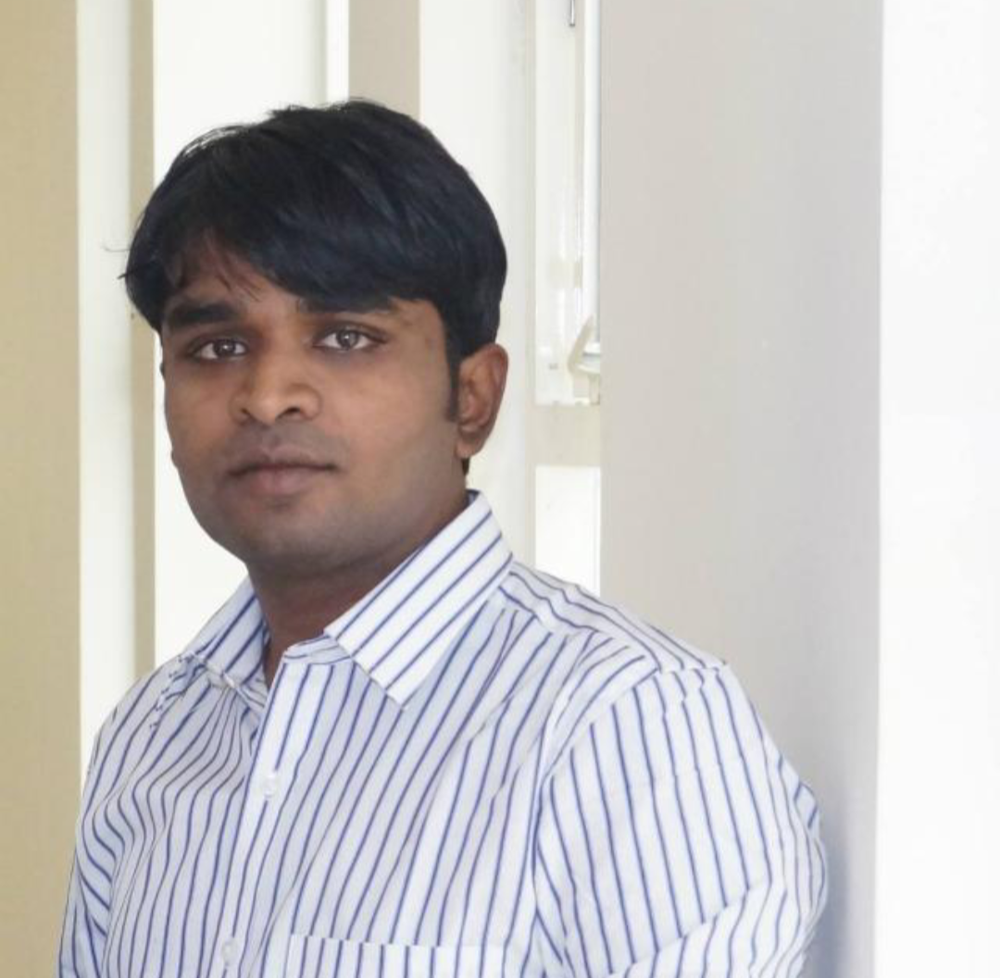

## About Me:

I am a MS by Research student in the Centre for Visual Information Technology(CVIT) lab of International Institute of Information Technology(IIIT) in Hyderabad. I like understanding why stuff works the way it works. In addition to ML and DL, I like Mathematics and Physics. My liking for Mathematics draws my interest and efforts towards understanding the mathematics behind working of Deep Learning models. I am interested in classical methods and Deep Learning models of Computer Vision. I graduated as a Mechanical Engineer and worked in Bharat Heavy Electricals Limited, Hyderabad before joining MS by Research at IIIT Hyderabad. My ambition and my interest to keep myself abreast with the advances in technology have drawn me towards the field of Machine learning and Deep Learning.

## Research:

At CVIT lab of IIIT, Hyderabad, I worked on Adverse Weather conditions dataset. I am presently working on Object Detection and Segmentation.

## Contact:

I love discussions on Machine Learning, Deep Learning applied to Computer Vision, Mathematics and Physics. You can reach me on umamahesh.j@research.iiit.ac.in

## CV:

[Link](Resume.pdf)
